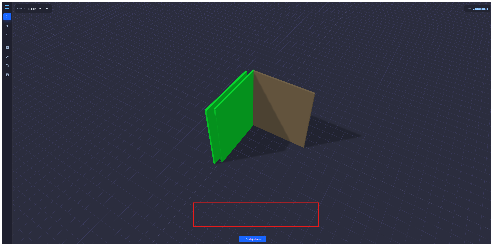

1. Ikonki generalnie wyglądają po prostu źle, możesz pobrać albo użyć jakiejś otwartej biblioteki z ikonkami?

Strzałka nie wygląda jak strzałka, zmiana pozycji powinna być czterema strzałkami w każdą stronę (coś jak róża wiatrów). Reszta ikonek też jest trochę mało wymowna.

2. Gdy klikniemy Hamburger powinien otworzyć nam się widok projektów. Przed jego otwarciem program musi zapytać czy zapisać aktualny projekt, jeśli jest niezapisany. Po otwarciu widoku projektów, powinniśmy zobaczyć listę projektów, które mamy zapisane. Po kliknięciu na projekt, powinien się on otworzyć.
3. Każdy projekt powinien miec historię zmian. Każdą zmianę jaką wykonamy - dodanie obiektu, poruszenie konkretnego obiektu, komponentu itp musimy rejestrować w historii zmian w bazie danych i przywracać wedle tego co chce użytkownik. Dodaj proszę dodatkową ikonkę "czasu" w nawigacji i tam wyświetlaj sidebar z lewej strony z każdą akcją. Jak wybierzemy konkretną akcję z listy, to pokaże nam się pod nią przycisk "cofnij do tego momentu" i wszystkie powyżej oznaczy na szary kolor (nieaktywne). Przed wykonaniem jakiejkolwiek akcji tutaj (użytkownik może przeglądać meble, ale przed jakąkolwiek edycją np. ruchem/zmianą koloru itp) wyświetli się informacja "historia zostanie zresetowana do tego momentu, czy jesteś pewny?" i wtedy usuwamy całość historii w górę i użytkownik wraca do tego konkretnego momentu.
4. Stwórz proszę nawigacyjne menu kontekstowe na dole:

i w tym miejscu gdy użytkownik wybierze obiekt, pojawią się ikonki: ruch, obróć, materiały itp itd. Generalnie edycja obiektu.
5. Gdy użytkownik wybierze ruch, zastępujemy ten widok edycją ruchu z ikonkami: wybór osi X/Y/Z i następnie: góra, prawo, dół, lewo, obrót w prawo, obrót w lewo. Obrót osi nie znika, wybieramy ikonkę obrotu osi np. X i wtedy zaznaczamy ją, a resztę zaznaczamy na szaro (nieaktywne) i możemy edytować konkretną oś.
6. Dodajemy powoli skróty klawiszowe. Dodaj kopiowanie obiektu na Ctrl+C i jego wklejanie na Ctrl+V. Dodatkowo gdy użytkownik przytrzyma CTRL może wybrać parę obiektów i wtedy w pasku kontekstowym na środku dajemy opcję "kopiuj obiekty". 
7. Chcę abyś dodał opcję "przyklej do krawędzi".
      7.1. Ikonka przyklej do krawędzi pojawia się w menu kontekstowym na środku, zrób to jako ikonkę "magnesu".
      7.2. W trybie przyklej do krawędzi użytkownik może wybrać krawędź obiektu, do której chce się przykleić. Po wybraniu krawędzi, program automatycznie przesunie obiekt tak, aby jego krawędź była idealnie dopasowana do wybranej krawędzi innego obiektu. Pamiętaj że użytkownik może wybrać większa płaszczyznę innego obiektu, więc wtedy zanim dokleisz do niego (np. mają inne wysokości) zapytasz użytkownika czy dorównać do konkretnej krawędzi czy dorównać wysokość obiektów aby były takie same. Generalnie chciałbym aby w tym trybie był również tryb "siatki", gdzie możemy sami wybrać punkt do którego możemy dokleić dla obu obiektów. Nie wiem czy nie brzim to zagmatwanie, ale chciałbym również opcje żeby te obiekty mogły być przyklejone do jakiegokolwiek miejsca innego obiektu jeśli wiesz o co chodzi, bo niektóre przedmioty nie będą konkretnie w danym miejscu. Generalnie cohdzi również o "anchoring". czyli jak np. dopnę nóżkę meblową do jednego z paneli, to chciałbym żeby w przypadku zmiany wymiarów podążała np. za lewym-dolnym rogiem. 